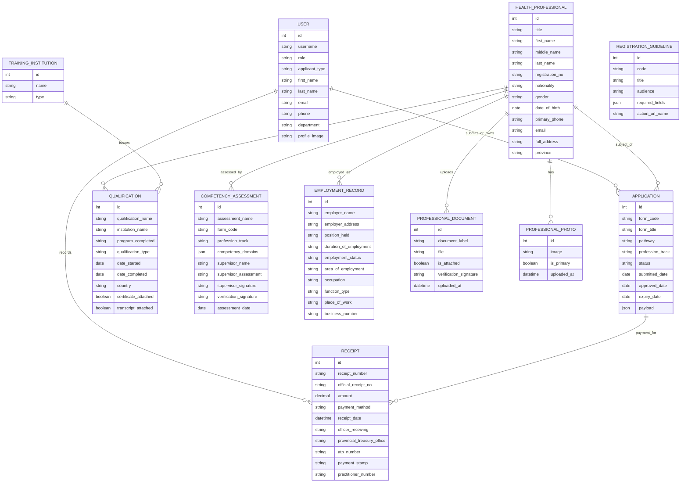

# PNGNCRF Unified Schema And ER Diagram

## Purpose

This document consolidates the PNG Nursing Council Registration Forms (PNGNCRF 2016) into a normalized database blueprint for the online registration system.

It aligns the recurring form fields across:

- `G1` to `G7`
- `NC1` to `NC11`

and maps them into reusable data entities already reflected in the Django project.

---

## Unified Field Mapping Table

| Field Name | Applies To Forms |
|---|---|
| Full Name | G1, G2, G3, G4, G5, G6, G7, NC1, NC2, NC3, NC5, NC6, NC7, NC8, NC10, NC11 |
| Date of Birth | G3, NC1, NC3 |
| Gender | NC1, NC3 |
| Nationality | NC1, NC3, NC5 |
| Contact Information (Phone/Email) | G3, NC1, NC2, NC3, NC5, NC8 |
| Institute Name | G1, G2, G6, G7, NC1 |
| Program Completed | G1, G3, G5, G6, NC1, NC5 |
| Date of Completion | G1, G6, NC1, NC5 |
| Graduate List (Batch Names) | G2, G7 |
| Clinical Placements | G3 |
| Skills Log Summary | G3 |
| Competency Domains | G4, G5, NC6, NC7, NC10, NC11 |
| Supervisor’s Assessment | G4, G5, NC6, NC7, NC10, NC11 |
| Supervisor’s Signature & Date | G4, G5, NC6, NC7, NC10, NC11 |
| Provisional Licence Number | NC2 |
| Employer Name | NC2, NC3, NC5, NC8, NC11 |
| Employer Address | NC2, NC3, NC5, NC8 |
| Position Held | NC2, NC5, NC8 |
| Duration of Employment | NC2, NC5, NC8 |
| Employment Status | NC3 |
| Area of Employment | NC3 |
| Occupation | NC3 |
| Function Type | NC3 |
| Place of Work | NC3 |
| Business Address | NC3 |
| Business Number | NC3 |
| Reasons for Unemployment | NC3 |
| Post-Graduate Qualification Details | NC3 |
| Passport Copy | NC4, NC9 |
| Qualification Certificates | NC1, NC4, NC5, NC9 |
| Transcript | NC1, NC4 |
| Employer Reference | NC4, NC9 |
| Competency Evidence | NC1, NC4, NC5, NC9, NC11 |
| Licence Duration Requested | NC8 |
| Nursing Category (checkboxes) | NC3 |
| Payment Details (Receipt, Amount, Officer, Treasury Office, Stamp, Practitioner Number) | NC3 |
| Declaration (Signature & Date) | All NC forms, most G forms |
| Verification Signature/Stamp | G1, G6, NC1, NC4 |

---

## Normalized Schema

### Core Entities

- `Users`
  Personal details, authentication, role, contact details, staff profile image, applicant images

- `Applications`
  One submission record per form instance with form code, pathway, title, review state, payload snapshot

- `Qualifications`
  Institution, program, completion date, transcript or certificate presence

- `Competencies`
  Domains, supervisor assessment, signature, verification, assessment date

- `Employment`
  Employer details, employment status, role, workplace and duration

- `Documents`
  Passport, certificates, transcript, employer reference, competency evidence, verification uploads

- `Payments`
  Receipt data and renewal-related payment records

### Supporting Entities

- `TrainingInstitution`
- `Facility`
- `Location`
- `Cadre`
- `RegistrationGuideline`

---

## Current Project Mapping

The current Django project aligns these concepts primarily through:

- `apps.accounts.models.User`
- `apps.workforce.models.Application`
- `apps.workforce.models.Qualification`
- `apps.competency.models.CompetencyAssessment`
- `apps.workforce.models.EmploymentRecord`
- `apps.workforce.models.ProfessionalDocument`
- `apps.dashboard.models.Receipt`
- `apps.dashboard.models.RegistrationGuideline`

---

## ER Diagram

---

## Pathway Summary

### Local Nursing Graduates

`G1 -> G2 -> G3 -> G4 -> NC1 -> NC6 -> NC2 -> NC3`

### Local Midwifery Graduates

`G6 -> G7 -> G3 -> G5 -> NC1 -> NC7 -> NC2 -> NC3`

### Overseas Nurses

`NC1 -> NC4 -> NC6 -> NC5 -> NC10 -> NC8 -> NC9`

### Overseas Midwives

`NC1 -> NC4 -> NC7 -> NC5 -> NC8 -> NC9`

### Special Cases

`NC11`

---

## Design Notes

- Personal details should not be duplicated across every form table.
- Each form submission should keep a payload snapshot in `Application.payload` even when normalized records also exist.
- Qualifications, competencies, employment records, and documents should remain reusable across multiple form codes.
- `NC3` payment fields are best stored in `Receipt` and linked to the renewal `Application`.
- Registration guidelines should remain data-driven so dashboards can show pathway-specific instructions.

---

## Recommended Next Step

Use this document as the source of truth when:

- refining form validation rules
- expanding admin review screens
- generating printable submission summaries
- building reporting by pathway and form code
