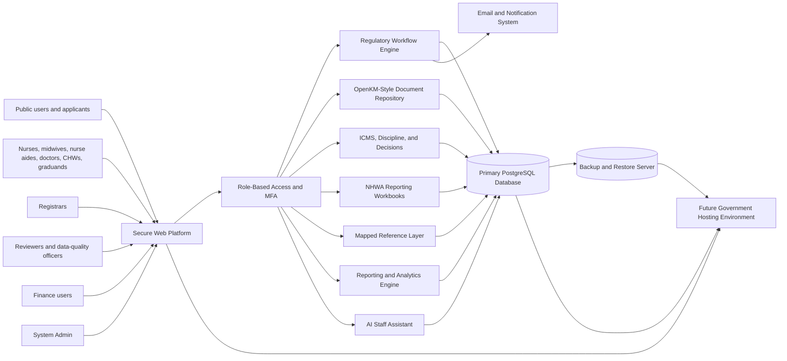
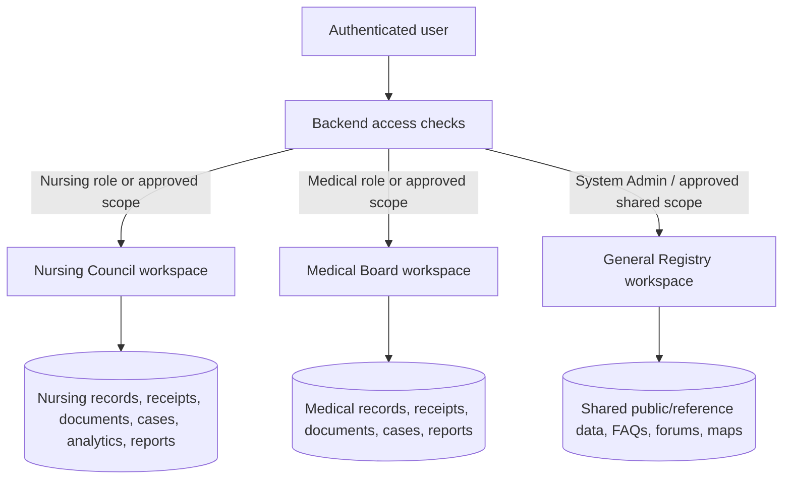
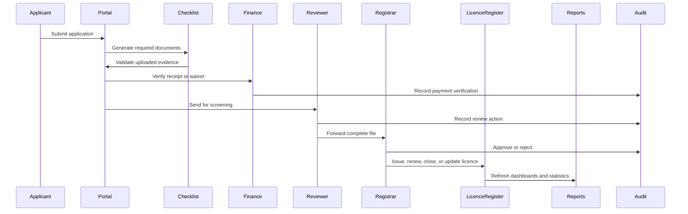
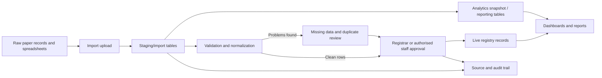
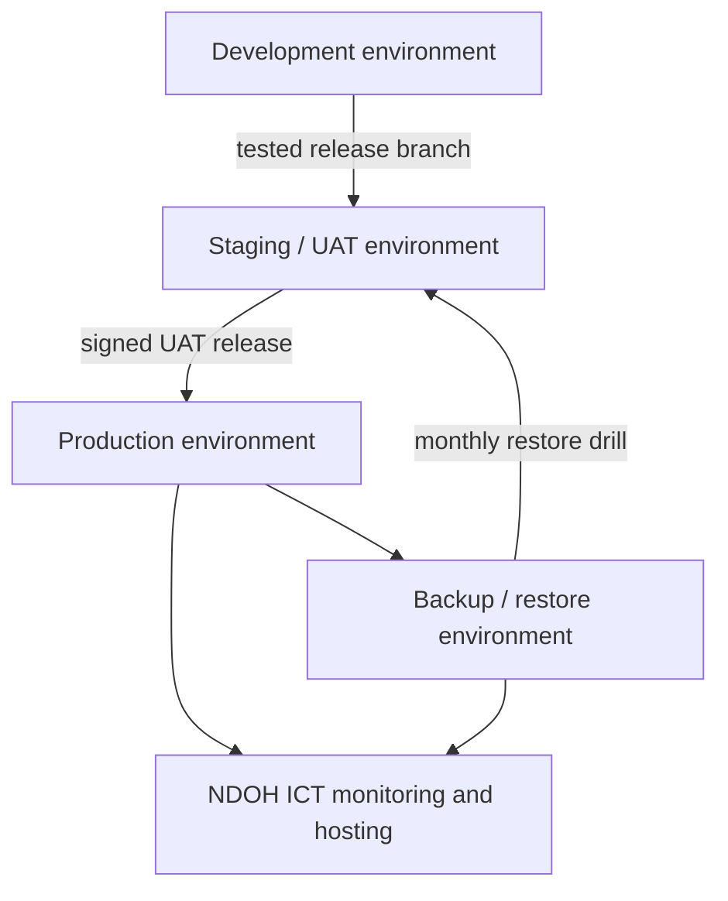

# 02 Technical Architecture

## Enterprise Architecture View

## Regulatory Workspace Separation

## Application-To-Licence Workflow Architecture

## Import Staging Architecture

## Deployment Architecture

## Main Components

| Component | Responsibility |
|---|---|
| Public portal | Public sign-in, registration, password reset, register search, help guidance |
| Staff dashboards | Registrar, reviewer, finance, data-quality, and System Admin work areas |
| Workflow engine | Application statuses, checklist gating, payment gating, registrar decisions, licence actions |
| Document repository | Official record storage, metadata, OCR/search, versions, approval/rejection sign-off, retention, office scope, audit events |
| Case management layer | ICMS complaint cases, disciplinary cases, regulatory decisions, case events, attachments, and evidence links |
| Data import layer | Source tracking, staging rows, analytics snapshots, workbook import, ATP/N-DATA alignment, Catherine workbook alignment, cleansing queues |
| NHWA reporting layer | NHWA workbook templates, population from verified data, review, sign-off, and export |
| Mapping/reference layer | Mapped schools, institutions, facilities, aliases, verification status, and stored coordinates |
| Reporting engine | Monthly analytics, yearly analytics, active Nursing Council snapshot analytics, financial forecast, management brief outputs |
| Security layer | Role checks, MFA, secure password reset, secure cookies, session timeout, admin restriction |
| Notification layer | Staff inbox, chat, mailbox folders, notification history, unread badge clearing, opened/read status, operational access requests, email notifications |
| Records table layer | Records Hub and duplicate-review queue table functions for authorised registrar, admin, reviewer, and data-quality workflows |
| Database | Master registry, application, licence, receipt, document, case, decision, NHWA, map, audit, import, and user data |
| Backup server | Scheduled database and media backups with restore testing |
| Government hosting | Future production hosting under approved NDOH ICT infrastructure |
